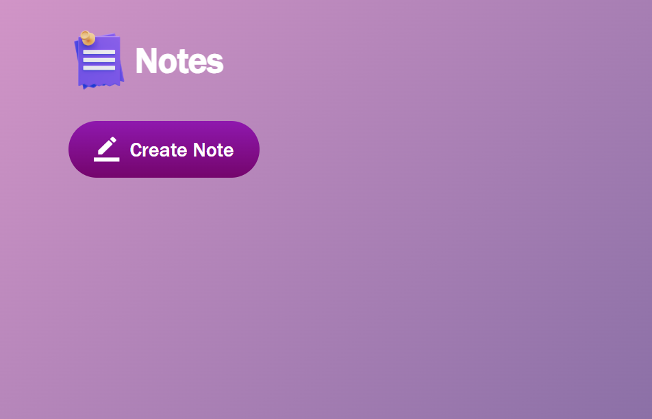
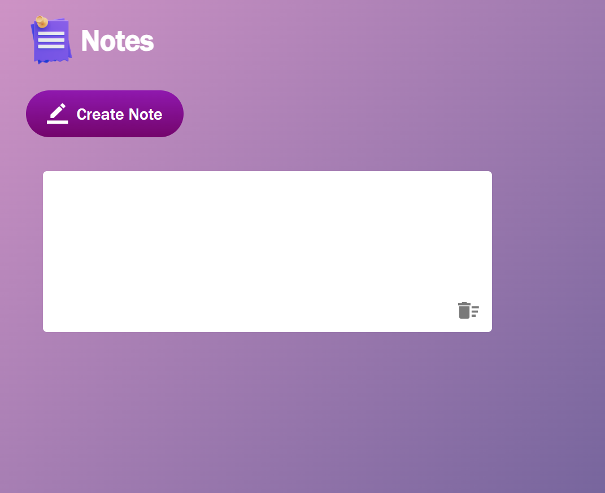
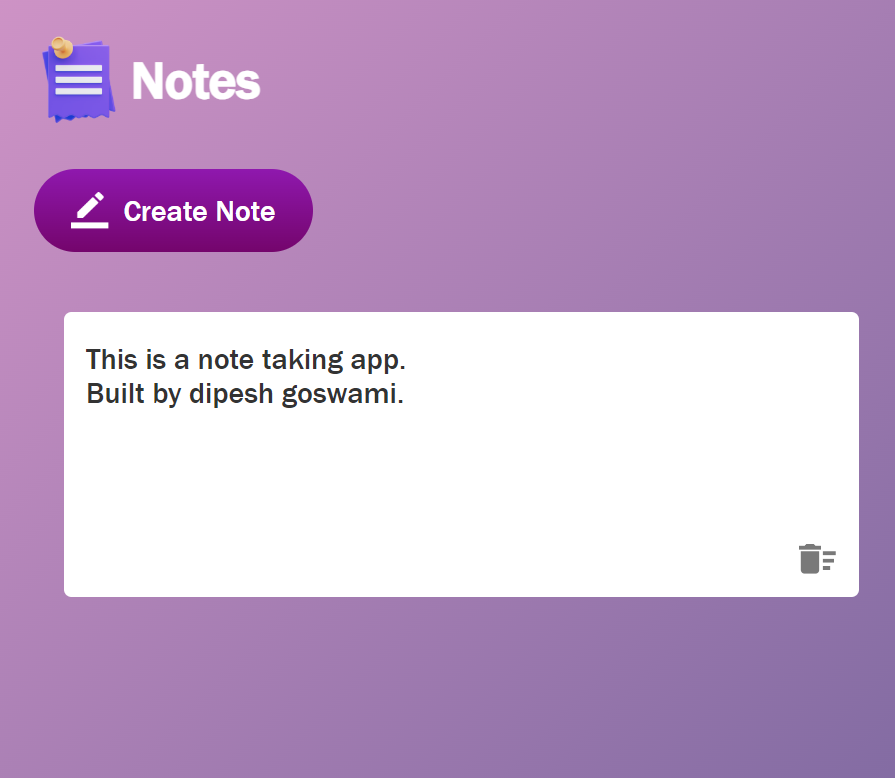
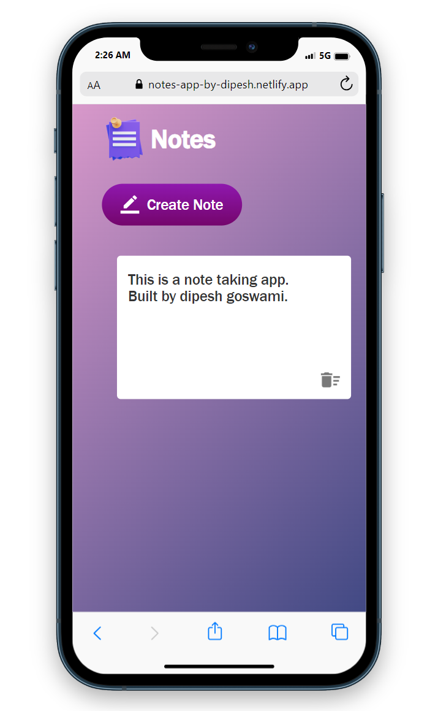

# Notes-App
>You can take notes using this app. Notes will be saved in LocalStorage of browser.

[Click Here to see this app live](https://notes-app-by-dipesh.netlify.app/)

 

 

 

## Technology Used:
* Javascript
* HTML
* CSS

## Features:
* You can click on create button to create new poster for note.
* you can write anything on that poster.
* you can delete that poster by clicking on delete icon.
